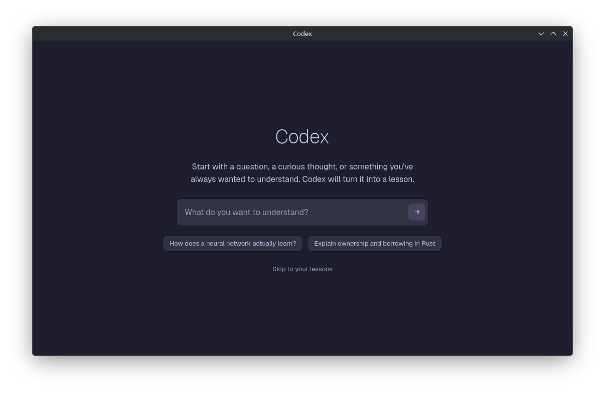

# Codex

**An interactive learning environment powered by LLMs.**

Start with a question, a curious thought, or something you've always wanted to understand. Codex will turn that into the
beginning of a new learning journey.

It creates lessons for you, keeps track of your progress, and helps guide you toward your next goal. 
Along the way, you can see ideas come to life through graphs, flow charts, diagrams, and playful visualisations.

*Less vibecoding, more learning.*

## Showcase

> [!WARNING]
> No functionality is implemented yet, this is just a showcase of what it currently looks like.

